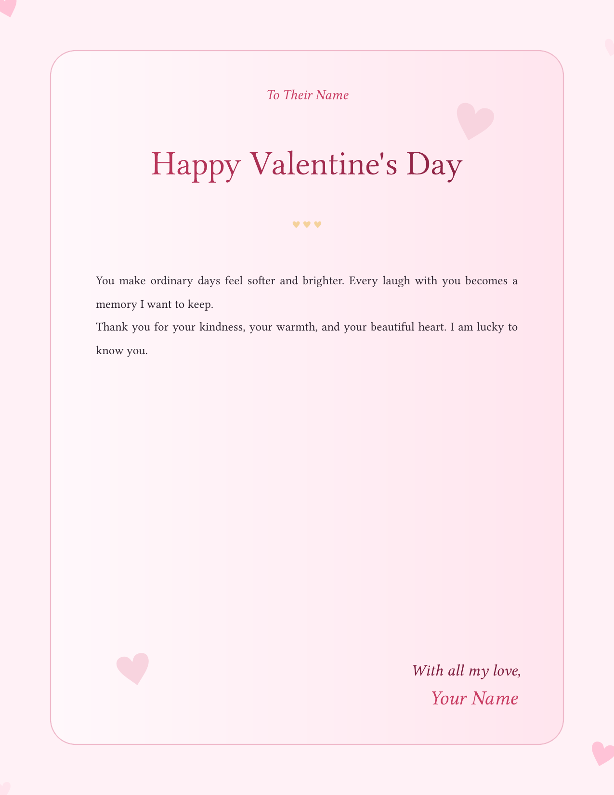
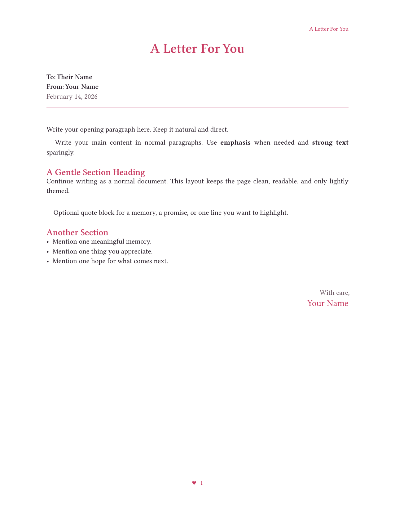
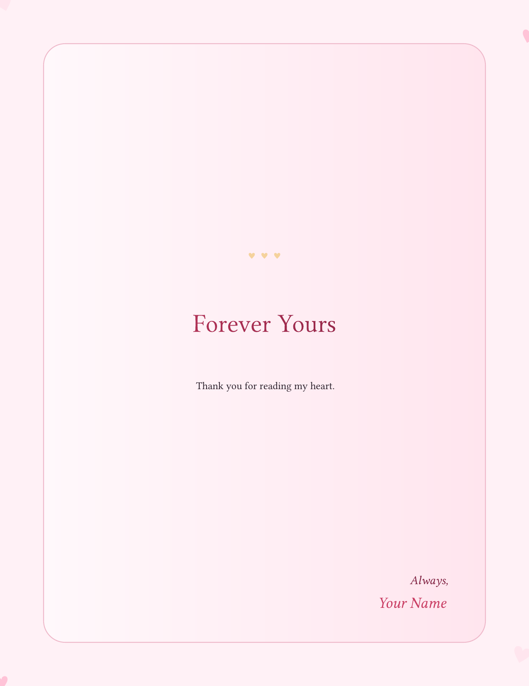

# loveletter.typ
for when you need to write something to that beautiful someone

## Showcase

| Page 1 | Page 2 | End Page |
| --- | --- | --- |
|  |  |  |

## Password Protect PDF

You can password-protect the final PDF with `qpdf`.

```bash
qpdf --encrypt "open-password" "owner-password" 256 \
  -- loveletter.pdf loveletter-protected.pdf
```

- Replace `"open-password"` with the password required to open the file.
- Replace `"owner-password"` with the permissions password.
- Output file: `loveletter-protected.pdf`

Optional check:

```bash
qpdf --show-encryption loveletter-protected.pdf
```
